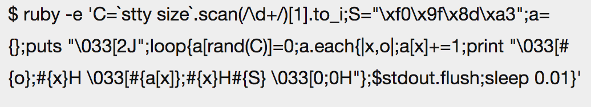

% 画面制御エスケープシークエンス
% yamotonalds
% 2017-06-19

# 画面制御エスケープシークエンス

## 

pecoっぽいツールはどうやったら作れるか？

そもそも画面消して何か表示してそれ消して元に戻ってくるってどうやるの？

. . . 

→エスケープシークエンスでできるっぽい

## エスケープシークエンスとは

文字以外の何かを制御するための特殊な数値の連続で、エスケープから始まるやつ

## エスケープって？

<table style="font-size: 18px;">
<tbody>
<tr><td> </td><th>00　</th><th>10　</th><th>20　</th><th>30　</th><th>40　</th><th>50　</th><th>60　</th><th>70　</th></tr>
<tr><th>00</th><td><span style="color:orange;">NUL</span></td><td><span style="color:orange;">DLE</span></td><td><span style="color:#0099FF;">SP</span></td><td>0</td><td>@</td><td>P</td><td>`</td><td>p</td></tr>
<tr><th>01</th><td><span style="color:orange;">SOH</span></td><td><span style="color:orange;">DC1</span></td><td>!</td><td>1</td><td>A</td><td>Q</td><td>a</td><td>q</td></tr>
<tr><th>02</th><td><span style="color:orange;">STX</span></td><td><span style="color:orange;">DC2</span></td><td>"</td><td>2</td><td>B</td><td>R</td><td>b</td><td>r</td></tr>
<tr><th>03</th><td><span style="color:orange;">ETX</span></td><td><span style="color:orange;">DC3</span></td><td>#</td><td>3</td><td>C</td><td>S</td><td>c</td><td>s</td></tr>
<tr><th>04</th><td><span style="color:orange;">EOT</span></td><td><span style="color:orange;">DC4</span></td><td>$</td><td>4</td><td>D</td><td>T</td><td>d</td><td>t</td></tr>
<tr><th>05</th><td><span style="color:orange;">ENQ</span></td><td><span style="color:orange;">NAK</span></td><td>%</td><td>5</td><td>E</td><td>U</td><td>e</td><td>u</td></tr>
<tr><th>06</th><td><span style="color:orange;">ACK</span></td><td><span style="color:orange;">SYN</span></td><td>&amp;</td><td>6</td><td>F</td><td>V</td><td>f</td><td>v</td></tr>
<tr><th>07</th><td><span style="color:orange;">BEL</span></td><td><span style="color:orange;">ETB</span></td><td>'</td><td>7</td><td>G</td><td>W</td><td>g</td><td>w</td></tr>
<tr><th>08</th><td><span style="color:orange;">BS</span></td><td><span style="color:orange;">CAN</span></td><td>(</td><td>8</td><td>H</td><td>X</td><td>h</td><td>x</td></tr>
<tr><th>09</th><td><span style="color:orange;">HT</span></td><td><span style="color:orange;">EM</span></td><td>)</td><td>9</td><td>I</td><td>Y</td><td>i</td><td>y</td></tr>
<tr><th>0A</th><td><span style="color:orange;">LF</span></td><td><span style="color:orange;">SUB</span></td><td> *</td><td>:</td><td>J</td><td>Z</td><td>j</td><td>z</td></tr>
<tr><th>0B</th><td><span style="color:orange;">VT</span></td><td><span style="color:red;">ESC</span></td><td>+</td><td>;</td><td>K</td><td>[</td><td>k</td><td>{</td></tr>
<tr><th>0C</th><td><span style="color:orange;">FF</span></td><td><span style="color:orange;">FS</span></td><td>,</td><td>&lt;</td><td>L</td><td>&#92;</td><td>l</td><td>|</td></tr>
<tr><th>0D</th><td><span style="color:orange;">CR</span></td><td><span style="color:orange;">GS</span></td><td>-</td><td>=</td><td>M</td><td>]</td><td>m</td><td>}</td></tr>
<tr><th>0E</th><td><span style="color:orange;">SO</span></td><td><span style="color:orange;">RS</span></td><td>.</td><td>&gt;</td><td>N</td><td>^</td><td>n</td><td>~</td></tr>
<tr><th>0F</th><td><span style="color:orange;">SI</span></td><td><span style="color:orange;">US</span></td><td>/</td><td>?</td><td>O</td><td>_</td><td>o</td><td><span style="color:orange;">DEL</span></td></tr>
</tbody>
</table>

## ESCの表記

- `0x1b` (16進数)
- `033` (8進数)
    - `27` (10進数)
- `\e`
- `^[`

## エスケープシークエンスでできること

- カーソル移動・テキストクリア
    - CSI（Control Sequence Introducer）
- 色・スタイル変更
    - SGR（Select Graphics Rendition）
- 表示倍率変更

等

## 例

<table>
<tbody>
<tr><td>`\e[2J`</td><td>画面クリア</td></tr>
<tr><td>`\e[n;mH`</td><td>n行m列目にカーソルを移動</td></tr>
<tr><td>`\e[?25l`</td><td>カーソルを非表示にする</td></tr>
<tr><td>`\e[?25h`</td><td>カーソルを表示する</td></tr>
<tr><td>`\e[31m`</td><td>文字を赤にする</td></tr>
</tbody>
</table>

# コーディング例

## シェル

```sh
print "\x1b[38;5;208mりんご\x1b[m"
print "\033[38;5;208mりんご\033[m"
print "\e[38;5;208mりんご\e[m"
```

## Ruby

```rb
print "\x1b[38;5;208mりんご\x1b[m"
print "\033[38;5;208mりんご\033[m"
print "\e[38;5;208mりんご\e[m"
```

## Go

```go
fmt.Print("\x1b[38;5;208mりんご\x1b[m")
fmt.Print("\033[38;5;208mりんご\033[m")
```

# 実例

## くるくる回るやつ

```sh
for i in `seq 1 10`
do
  printf "\e[D|" ; sleep 0.1;
  printf "\e[D/" ; sleep 0.1;
  printf "\e[D-" ; sleep 0.1;
  printf "\e[D\\"; sleep 0.1;
done
```


## 🍣が降るスクリプト

## 何年か前に話題になった




## 少し読みやすくすると

```rb
C=`stty size`.scan(/\d+/)[1].to_i
S="🍣"
pos={}
puts "\033[2J"
loop {
  pos[rand(C)]=0
  pos.each { |col,old_row|
    pos[col]+=1
    print "\033[#{old_row};#{col}H \033[#{pos[col]}#{col}H#{S} \033[0;0H"
  }
  $stdout.flush
  sleep 0.01
}
```

# 自分でも🍣動かしてみた


#

## おわりに

- エスケープシークエンスで文字の色変えたり🍣動かしたりできる
- 入力のことも考えるとツール作るときはライブラリ使った方が良さそう

## iTerm2での画像表示


>ESC ] 1337 ; File = [optional arguments] : base-64 encoded file contents ^G


```rb
filename = 'serval_jump.png'
data = `base64 < #{filename}`
char = "\033]1337;File=inline=1:#{data}\a"
```
